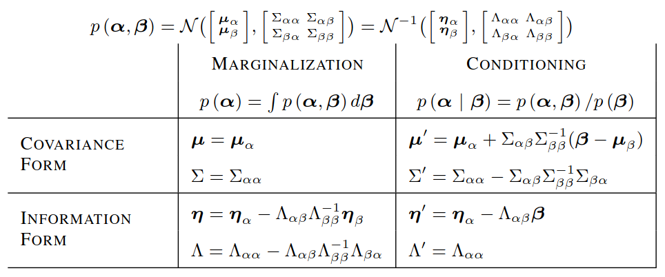
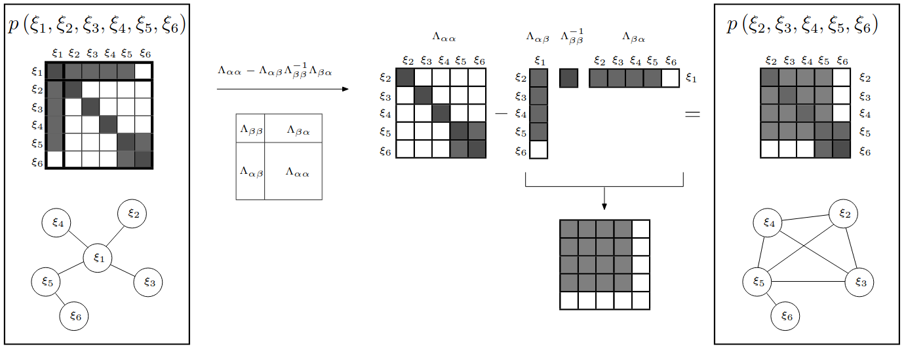
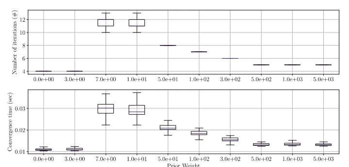
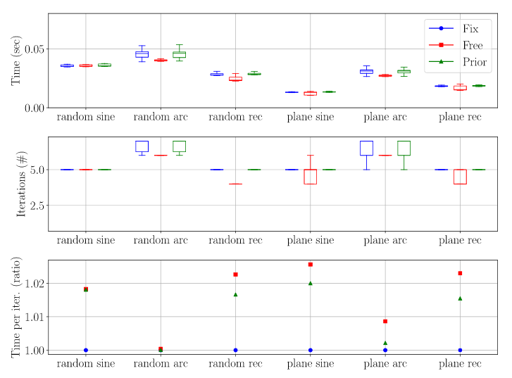
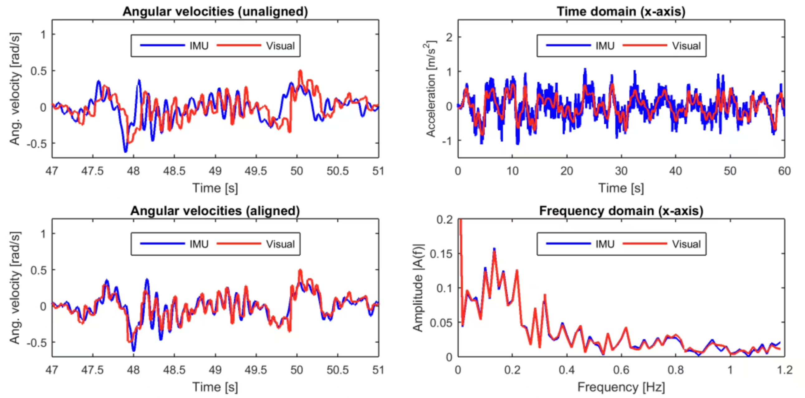
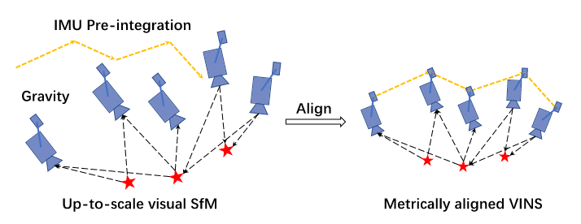
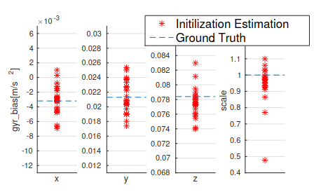
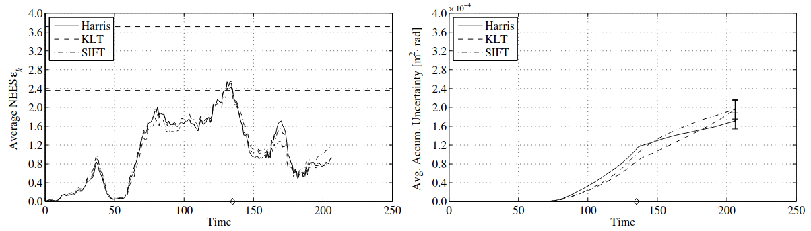
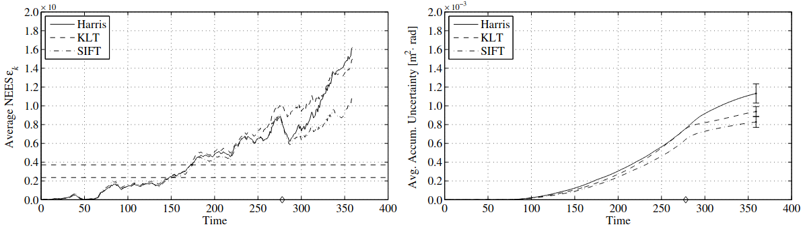
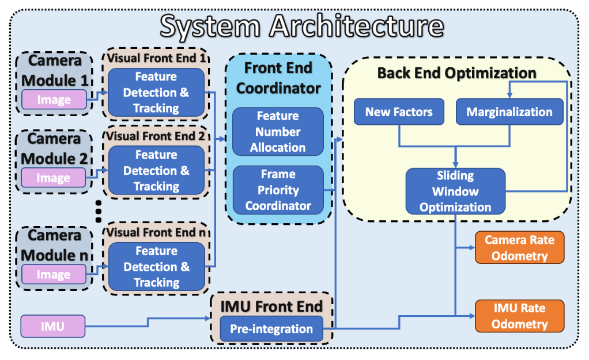

# SLAM 文献库

## Contents

- **Graph Theory**

  - M. R. Walter, R. M. Eustice, and J. J. Leonard, “Exactly Sparse Extended Information Filters for Feature-based SLAM,” *The International Journal of Robotics Research*, vol. 26, no. 4, pp. 335–359, Apr. 2007, doi: [10.1177/0278364906075026](https://doi.org/10.1177/0278364906075026).
  - G. Grisetti, R. Kummerle, C. Stachniss, and W. Burgard, “A Tutorial on Graph-Based SLAM,” *IEEE Intell. Transport. Syst. Mag.*, vol. 2, no. 4, pp. 31–43, 2010, doi: [10.1109/MITS.2010.939925](https://doi.org/10.1109/MITS.2010.939925).
  - R. Kummerle, G. Grisetti, H. Strasdat, K. Konolige, and W. Burgard, “G^2^o: A general framework for graph optimization,” in _2011 IEEE International Conference on Robotics and Automation_, Shanghai, China: IEEE, May 2011, pp. 3607–3613. doi: [10.1109/ICRA.2011.5979949](https://doi.org/10.1109/ICRA.2011.5979949).

- **Observability and Consistency**

  - C. Jauffret, “Observability and fisher information matrix in nonlinear regression,” *IEEE Transactions on Aerospace and Electronic Systems*, vol. 43, no. 2, pp. 756–759, 2007, doi: [10.1109/TAES.2007.4285368](https://doi.org/10.1109/TAES.2007.4285368).
  - Z. Zhang, G. Gallego, and D. Scaramuzza, “On the Comparison of Gauge Freedom Handling in Optimization-Based Visual-Inertial State Estimation,” *IEEE Robot. Autom. Lett.*, vol. 3, no. 3, pp. 2710–2717, Jul. 2018, doi: [10.1109/LRA.2018.2833152](https://doi.org/10.1109/LRA.2018.2833152).

- **Visual SLAM**

  - *Initialization*

    - J. Mustaniemi, J. Kannala, S. Särkkä, J. Matas, and J. Heikkilä, “Inertial-Based Scale Estimation for Structure from Motion on Mobile Devices,” Aug. 11, 2017, _arXiv_: arXiv:1611.09498. doi: [10.48550/arXiv.1611.09498](https://doi.org/10.48550/arXiv.1611.09498).

    - T. Qin and S. Shen, “Robust initialization of monocular visual-inertial estimation on aerial robots,” in *2017 IEEE/RSJ International Conference on Intelligent Robots and Systems (IROS)*, Vancouver, BC: IEEE, Sep. 2017, pp. 4225–4232. doi: [10.1109/IROS.2017.8206284](https://doi.org/10.1109/IROS.2017.8206284).

  - *Visual Front End*

    - J. Klippenstein and H. Zhang, “Performance evaluation of visual SLAM using several feature extractors,” in *2009 IEEE/RSJ International Conference on Intelligent Robots and Systems*, St. Louis, MO, USA: IEEE, Oct. 2009, pp. 1574–1581. doi: [10.1109/IROS.2009.5354001](https://doi.org/10.1109/IROS.2009.5354001).
    - F. Endres, J. Hess, N. Engelhard, J. Sturm, D. Cremers, and W. Burgard, “An evaluation of the RGB-D SLAM system,” in *2012 IEEE International Conference on Robotics and Automation*, St Paul, MN, USA: IEEE, May 2012, pp. 1691–1696. doi: [10.1109/ICRA.2012.6225199](https://doi.org/10.1109/ICRA.2012.6225199).
    - J. Hartmann, J. H. Klussendorff, and E. Maehle, “A comparison of feature descriptors for visual SLAM,” in *2013 European Conference on Mobile Robots*, Barcelona, Catalonia, Spain: IEEE, Sep. 2013, pp. 56–61. doi: [10.1109/ECMR.2013.6698820](https://doi.org/10.1109/ECMR.2013.6698820).
  
  - *Filter-based System*
  
  - *Optimization-based system*
  
  - *Stereo Camera*
  - L. Wang, Y. Xu, and S. Shen, “VINS-Multi: A Robust Asynchronous Multi-camera-IMU State Estimator,” May 23, 2024, *arXiv*: arXiv:2405.14539. doi: [10.48550/arXiv.2405.14539](https://doi.org/10.48550/arXiv.2405.14539).

## Graph Theory

#### Exactly Sparse Extended Information Filters for Feature-based SLAM

M. R. Walter, R. M. Eustice, and J. J. Leonard, “Exactly Sparse Extended Information Filters for Feature-based SLAM,” *The International Journal of Robotics Research*, vol. 26, no. 4, pp. 335–359, Apr. 2007, doi: [10.1177/0278364906075026](https://doi.org/10.1177/0278364906075026).

作者给出了在边际概率和条件概率中协方差矩阵和信息矩阵的表达的总结

当需要删除一个变量时，直接丢弃变量和对应的测量值,会使系统损失一部分信息。更合适的做法是使用边际概率,将丢弃变量所携带的信息通过剩余变量的隐式表达来保留。在边缘化的操作中，稀疏的信息矩阵慢慢变得稠密，原本不相关的变量慢慢变得相关。

---

#### A Tutorial on Graph-Based SLAM

G. Grisetti, R. Kummerle, C. Stachniss, and W. Burgard, “A Tutorial on Graph-Based SLAM,” *IEEE Intell. Transport. Syst. Mag.*, vol. 2, no. 4, pp. 31–43, 2010, doi: [10.1109/MITS.2010.939925](https://doi.org/10.1109/MITS.2010.939925).

SLAM问题被定义为：在给定初状态和一系列输入与观测的基础上，找到有最大似然概率的轨迹和地图。其中常见的地图表达包括多层表面地图、点云地图和二维栅格地图。
$$
p(\bold x_{1:t},\bold m|\bold z_{1:t},\bold u_{1:t},\bold x_0)
$$
在图优化SLAM中，待估计的变量被定义为节点，而待估计变量构成的空间约束以残差形式构成图的边。图优化SLAM由此被解耦为从原始传感器数据构成图（前端）和在约束中找到有最大似然概率的参数（后端）两个问题。本文假设前端很完美地找到观测的对应关系，待优化的图被很好地建立起来的基础上，讨论后端图优化的基本技术。
$$
\bold x^* = \arg\min_{\bold x}\sum_{(i,j)\in\mathcal C} \bold e_{ij}^T\Omega_{ij}\bold e_{ij}
$$
其中残差利用一阶雅可比近似
$$
\bold e_{ij}(\breve{\bold x}_i+\Delta\bold x_i,\breve{\bold x}_j+\Delta\bold x_j) = \bold e_{ij}(\breve{\bold x}+\Delta\bold x) \approx \bold e_{ij} + \bold J_{ij}\Delta\bold x
$$
总损失函数有
$$
\begin{aligned}
\bold F(\breve{\bold x}+\Delta\bold x) &= \sum_{(i,j)\in\mathcal C}\bold e_{ij}(\breve{\bold x}+\Delta\bold x)^T\Omega_{ij}\bold e_{ij}(\breve{\bold x}+\Delta\bold x) \\
&\approx \sum_{(i,j)\in\mathcal C}(\bold e_{ij} + \bold J_{ij}\Delta\bold x)^T\Omega_{ij}(\bold e_{ij} + \bold J_{ij}\Delta\bold x) \\
&= \sum_{(i,j)\in\mathcal C}\underbrace{\bold e_{ij}^T\Omega_{ij}\bold e_{ij}}_{c_{ij}} + 2\underbrace{\bold e_{ij}^T\Omega_{ij}\bold J_{ij}}_{\bold b_{ij}}\Delta\bold x + \Delta\bold x^T\underbrace{\bold J_{ij}^T\Omega_{ij}\bold J_{ij}}_{\bold H_{ij}}\Delta\bold x \\
&= c+2\bold b^T\Delta\bold x + \Delta\bold x^T\bold H\Delta\bold x
\end{aligned}
$$
当上式关于 $\Delta\bold x$ 的导数为 $\bf0$ 时
$$
\bold H\Delta\bold x^* = -\bold b
$$
进一步论文给出了一种定义在流形上的误差项
$$
\bold e_{ij}(\bold x) = (\bold z_{ij}^{-1}\oplus(\bold x_i^{-1}\oplus\bold x_j))_{[1:6]} = \breve{\bold e}_{ij}+\tilde{\bold J}_{ij}\Delta\tilde{\bold x}
$$

$$
\begin{aligned}
\tilde{\bold J}_{ij} &= \begin{bmatrix} \cdots & \frac{\partial\bold e_{ij}(\breve{\bold x}\boxplus\Delta\tilde{\bold x})}{\partial\Delta\tilde{\bold x}_i}\bigg|_{\Delta\tilde{\bold x}=0} & \cdots & \frac{\partial\bold e_{ij}(\breve{\bold x}\boxplus\Delta\tilde{\bold x})}{\partial\Delta\tilde{\bold x}_j}\bigg|_{\Delta\tilde{\bold x}=0} & \cdots \end{bmatrix} \\
&= \begin{bmatrix} \cdots & \frac{\partial\bold e_{ij}(\breve{\bold x})}{\partial\breve{\bold x}_i}\cdot\frac{\breve{\bold x}_i\boxplus\Delta\tilde{\bold x}}{\partial\Delta\tilde{\bold x}_i}\bigg|_{\Delta\tilde{\bold x}=0} & \cdots & \frac{\partial\bold e_{ij}(\breve{\bold x})}{\partial\breve{\bold x}_j}\cdot\frac{\breve{\bold x}_j\boxplus\Delta\tilde{\bold x}}{\partial\Delta\tilde{\bold x}_j}\bigg|_{\Delta\tilde{\bold x}=0}  & \cdots \end{bmatrix}
\end{aligned}
$$

其中增量算子 $\oplus,\boxplus$ 为
$$
\bold x_i\oplus\bold x_j = \begin{bmatrix}\bold q_i(\bold t_j) \\ \bold q_i\otimes\bold q_j\end{bmatrix}
$$

$$
\bold x_i\boxplus\Delta\tilde{\bold x}_i = \bold x_i\oplus\begin{bmatrix} \Delta\tilde{\bold t}_i \\ \Delta\tilde{\bold q}_i \\ \sqrt{1-||\Delta\tilde{\bold q}_i||^2} \end{bmatrix}
$$

---

#### G^2^o: A general framework for graph optimization

R. Kummerle, G. Grisetti, H. Strasdat, K. Konolige, and W. Burgard, “G^2^o: A general framework for graph optimization,” in _2011 IEEE International Conference on Robotics and Automation_, Shanghai, China: IEEE, May 2011, pp. 3607–3613. doi: [10.1109/ICRA.2011.5979949](https://doi.org/10.1109/ICRA.2011.5979949).

基本上沿续了 **A Tutorial on Graph-Based SLAM** 的思路，补充了一些工程上的实现和实验的结果：使用阻尼法 $(\bold H+\lambda\bold I)\Delta\bold x^*=-\bold b$ 求解高斯牛顿，利用信息矩阵自伴随的特性用舒尔补快速求解 $\Delta\bold x^*$

---

## Observability and Consistency

#### Observability and fisher information matrix in nonlinear regression

C. Jauffret, “Observability and fisher information matrix in nonlinear regression,” *IEEE Transactions on Aerospace and Electronic Systems*, vol. 43, no. 2, pp. 756–759, 2007, doi: [10.1109/TAES.2007.4285368](https://doi.org/10.1109/TAES.2007.4285368).

给出了三种可观性的定义

在 $\theta_0$ 处简单可观 **Simply Observable**
$$
\forall\theta\in\R^d, \theta\ne\theta_0\Rightarrow h(\theta)\ne h(\theta_0)
$$
全局可观 **(Simply) Observable**
$$
\forall\theta,\theta'\in\R^d, \theta\ne\theta'\Rightarrow h(\theta)\ne h(\theta')
$$
在 $\theta_0$ 处局部可观 **Locally Observable**
$$
\exist U_{\theta_0} \subset\R^d\ (\text{open subset containing }\theta_0) \\
\forall \theta\in U_{\theta_0},\ \theta\ne\theta_0\Rightarrow h(\theta)\ne h(\theta_0)
$$
那么对于测量模型 $X=h(\theta)+\epsilon$ 而言，如果噪声的支持集 $p_\epsilon=\R^n$ 并且它的信息矩阵在 $\theta_0$ 处非奇异，或等价地 $\nabla_\theta h(\theta_0)\nabla_\theta^Th(\theta_0)$ 非奇异，那么该无噪声系统在 $\theta_0$ 处局部可观

---

#### On the Comparison of Gauge Freedom Handling in Optimization-Based Visual-Inertial State Estimation

Z. Zhang, G. Gallego, and D. Scaramuzza, “On the Comparison of Gauge Freedom Handling in Optimization-Based Visual-Inertial State Estimation,” *IEEE Robot. Autom. Lett.*, vol. 3, no. 3, pp. 2710–2717, Jul. 2018, doi: [10.1109/LRA.2018.2833152](https://doi.org/10.1109/LRA.2018.2833152).

视觉惯性系统存在四自由度不可观（平移和绕重力方向的旋转），高斯牛顿法求解线性方程时，奇异矩阵H不满秩（存在四维的零空间），求解稳定性较差。这些额外的规范自由度 Gauge Freedom 必须被妥善处理。作者对比了三种常见的处理策略以及它们对应的效果

**Gauge Fixation** 选择将第一帧的摄像机位姿固定，在全局优化中不更新。这等价于在全局优化时将第一帧摄像机位姿对应的残差的雅可比矩阵设为零矩阵。

**Gauge Prior** 选择为第一帧位姿加上定义在流形上的正则化惩罚项 $||\bold r_0^P||_{\Sigma_0^P}^2=||(\bold p_0-\bold p_0^0,\Delta\phi_{0z})||_{\Sigma_0^P}^2$

**Free Gauge** 方法则不增加先验约束，而是在优化时使用阻尼牛顿法，使 $\epsilon\bold I+\bold H$ 正定

作者接下来讨论了 **Gauge Prior** 中权重矩阵的选择的策略，并对比了三种方法的效果的差异。在权重矩阵等于协方差构成的单位阵 $\bold\Sigma_0^P = \boldsymbol\sigma_0^2\bold I$ 时，$||\bold r_0^P||_{\Sigma_0^P}^2=w^P||\bold r_0^P||^2, w^P = \frac1{\sigma_0^2}$。当 $w^P\to\infty$ 时，**Gauge Prior** 变成 **Gauge Fixation**，当 $w^P=0$ 时，**Gauge Prior** 变成 **Gauge Free**

权重 $w$ 对均方误差、迭代次数、收敛时间的影响都不大，并且在超过某个阈值后，三者都趋于平稳 

作者进一步实验讨论这种反常的收敛时间的增加。对于非常大的先验权重 $10^8$，该算法会降低重新投影误差，同时保持先验误差几乎等于零。相反，对于较小的先验权重（例如  $50\sim500$），优化算法会在前两次迭代中降低重新投影误差，但代价是增加先验误差。然后优化算法花费许多次迭代来微调先验误差，同时保持重新投影误差较小（沿轨道移动），因此计算时间会增加。

总的来说，三种方法对精度的影响并不显著。在权重合适的情况下，**Gauge Prior** 方法与 **Gauge Fixation** 几乎有相同的表现，而 **Free Gauge** 方法由于需要更少的迭代次数来收敛，消耗的时间会较少

---

## Visual SLAM

### Initialization

#### Inertial-Based Scale Estimation for Structure from Motion on Mobile Devices

J. Mustaniemi, J. Kannala, S. Särkkä, J. Matas, and J. Heikkilä, “Inertial-Based Scale Estimation for Structure from Motion on Mobile Devices,” Aug. 11, 2017, _arXiv_: arXiv:1611.09498. doi: [10.48550/arXiv.1611.09498](https://doi.org/10.48550/arXiv.1611.09498).

利用IMU原始信息而不是积分信息完成对齐工作，避免误差在预积分过程中被累计，开源了MATLAB代码。

通过图像计算相机外参数，利用B样条曲线插值得到角速度和线性加速度，再与IMU测量的原始角速度加速度构建联合损失函数。同时在频域上针对IMU噪声特性，引入高通滤波和低通滤波抑制噪声。

---

#### Robust initialization of monocular visual-inertial estimation on aerial robots

T. Qin and S. Shen, “Robust initialization of monocular visual-inertial estimation on aerial robots,” in *2017 IEEE/RSJ International Conference on Intelligent Robots and Systems (IROS)*, Vancouver, BC: IEEE, Sep. 2017, pp. 4225–4232. doi: [10.1109/IROS.2017.8206284](https://doi.org/10.1109/IROS.2017.8206284).

利用松耦合的方式对齐IMU与视觉

IMU测量模型有
$$
\begin{aligned}
\hat{\boldsymbol\omega} &= \boldsymbol\omega^b+\mathbf b^g+\mathbf n^g \\
\hat{\mathbf a} &= \mathbf R_{bw}(\mathbf a^w+\mathbf g^w)+\mathbf b^a+\mathbf n^a
\end{aligned} 
$$
预积分
$$
\begin{aligned}
\boldsymbol\alpha_{b_ib_j}&=\iint_{t \in [i,j]} \mathbf R_{b_ib_t} (\hat{\mathbf a}^{b_t}-\mathbf b^a) {\rm d} t^2\\
\boldsymbol\beta_{b_ib_j} &= \int_{t \in [i,j]} \mathbf R_{b_ib_t} (\hat{\mathbf a}^{b_t}-\mathbf b^a) {\rm d} t \\
\mathbf q_{b_ib_j}&= \int_{t \in [i,j]} \mathbf q_{b_ib_t} \otimes \begin{bmatrix} 0 \\ \frac12(\hat{\boldsymbol\omega}^{b_t}-\mathbf b^g) \end{bmatrix} {\rm d}t
\end{aligned}
$$
有一阶泰勒展开近似
$$
\begin{aligned}
\boldsymbol\alpha_{b_ib_j} &\approx \hat{\boldsymbol\alpha}_{b_ib_j} + \mathbf J_{b^a}^\alpha\delta\mathbf b^a + \mathbf J_{b^g}^\alpha\delta\mathbf b^g \\
\boldsymbol\beta_{b_ib_j} &\approx \hat{\boldsymbol\beta}_{b_ib_j} + \mathbf J_{b^a}^\beta\delta\mathbf b^a + \mathbf J_{b^g}^\beta\delta\mathbf b^g \\
\mathbf q_{b_kb_{k+1}} &\approx \hat{\mathbf q}_{b_kb_{k+1}}\otimes\begin{bmatrix}1\\\frac12\mathbf J_{b^g}^{\mathbf q}\delta\mathbf b^g\end{bmatrix}
\end{aligned}
$$
SfM给出视觉约束，$\bar ·$ 表示非米制单位
$$
\begin{aligned}
\mathbf q_{c_0b_k} &= \mathbf q_{c_0c_k} \otimes \mathbf q_{bc}^{-1} \\
s\bar{\mathbf p}_{c_0b_k} &= s\bar{\mathbf p}_{c_0c_k} - \mathbf R_{c_0b_k}\mathbf p_{bc}
\end{aligned}
$$

##### 估计外参数 $\bold q_{bc}$

对于相邻时刻 $k,k+1$ 的 IMU 旋转积分 $\mathbf q_{b_kb_{k+1}}$ 和视觉测量 $\mathbf q_{c_kc_{k+1}}$
$$
\mathbf q_{b_kc_{k+1}}=\mathbf q_{bc}\otimes\mathbf q_{c_kc_{k+1}}=\mathbf q_{b_kb_{k+1}}\otimes\mathbf q_{bc}
$$

$$
\left([\mathbf q_{c_kc_{k+1}}]_R - [\mathbf q_{b_kb_{k+1}}]_L\right)\mathbf q_{bc}=\mathbf0
$$

 $[·]_L, [·]_R$ 为四元数的左乘矩阵和右乘矩阵，$[·]_\times$ 为反对称矩阵
$$
\begin{aligned}\
[\mathbf q]_L &=q_\omega\mathbf I+\begin{bmatrix}0 & -\mathbf q_v^T \\ \mathbf q_v & [\mathbf q_v]_\times\end{bmatrix} \\
[\mathbf q]_R &= q_\omega\mathbf I+\begin{bmatrix}0 & -\mathbf q_v^T \\ \mathbf q_v & -[\mathbf q_v]_\times\end{bmatrix} \\
[\boldsymbol\omega]_\times &= \begin{bmatrix}0 & -\omega_z & \omega_y \\ \omega_z & 0 & -\omega_x \\ -\omega_y & \omega_x & 0\end{bmatrix}
\end{aligned}
$$

将多个时刻的 IMU 预积分和视觉测量累计，即可得到关于 $\mathbf q_{bc}$ 的超定方程组
$$
\begin{bmatrix}
[\mathbf q_{c_0c_1}]_R-[\mathbf q_{b_0b_1}]_L \\
[\mathbf q_{c_1c_2}]_R-[\mathbf q_{b_1b_2}]_L \\
\vdots \\
[\mathbf q_{c_nc_{n-1}}]_R-[\mathbf q_{b_nb_{n-1}}] \\
\end{bmatrix} \mathbf q_{bc} = \mathbf 0
$$
利用奇异值分解可解得 $\mathbf q_{bc}$

##### 估计陀螺仪偏置

标定得到 $\mathbf q_{bc}$ 后，利用旋转约束，可估计处陀螺仪偏置
$$
\delta\mathbf b^g = \arg\min_{\delta\mathbf b^g}\sum_{k\in{\mathcal B}} \left|\left|\left\lfloor\mathbf q_{c_0b_{k+1}}^{-1}\otimes\mathbf q_{c_0b_k} \otimes\mathbf q_{b_kb_{k+1}} \right\rfloor_{\text{xyz}}\right|\right|^2
$$
$\mathcal B$ 为所有关键帧的集合，其中目标函数取最小值 $0$ 时
$$
\mathbf q_{c_0b_{k+1}}^{-1}\otimes\mathbf q_{c_0b_k} \otimes\mathbf q_{b_kb_{k+1}}=\begin{bmatrix}1\\\mathbf0\end{bmatrix}
$$
又由旋转预积分一阶泰勒近似
$$
\mathbf q_{b_kb_{k+1}} \approx \hat{\mathbf q}_{b_kb_{k+1}}\otimes\begin{bmatrix}1\\\frac12\mathbf J_{b^g}^{\mathbf q}\delta\mathbf b^g\end{bmatrix}
$$
联立得到
$$
\begin{bmatrix}1\\\frac12\mathbf J_{b^g}^{\mathbf q}\delta\mathbf b^g\end{bmatrix} = \hat{\mathbf q}_{b_kb_{k+1}}^{-1}\otimes\mathbf q_{c_0b_k}^{-1}\otimes\mathbf q_{c_0b_{k+1}}
$$
考虑虚部
$$
\mathbf J_{b^g}^{\mathbf q}\delta\mathbf b^g = 2\left\lfloor\hat{\mathbf q}_{b_kb_{k+1}}^{-1}\otimes\mathbf q_{c_0b_k}^{-1}\otimes\mathbf q_{c_0b_{k+1}}\right\rfloor_{\text{xyz}}
$$
进一步可以构建正定方程组，通过 Cholesky 分解求解 $\delta\mathbf b^g$
$$
(\mathbf J_{b^g}^{\mathbf q})^T\mathbf J_{b^g}^{\mathbf q}\delta\mathbf b^g = 2(\mathbf J_{b^g}^{\mathbf q})^T\left\lfloor\hat{\mathbf q}_{b_kb_{k+1}}^{-1}\otimes\mathbf q_{c_0b_k}^{-1}\otimes\mathbf q_{c_0b_{k+1}}\right\rfloor_{\text{xyz}}
$$
解得 $\delta\mathbf b^g$ 后，重新计算预积分项 $\hat{\boldsymbol\alpha}_{b_kb_k+1}, \hat{\boldsymbol\beta}_{b_kb_{k+1}},\hat{\mathbf q}_{b_kb_{k+1}}$

##### 初始化速度、重力和尺度因子

所有我们希望估计的变量包括
$$
\mathcal X_I=\begin{bmatrix}\mathbf v_0^{b_0} & \mathbf v_1^{b_1} & \cdots \mathbf v_n^{b_n} & \mathbf g^{c_0} & \mathbf s\end{bmatrix}^T
$$
由 $1.3$ 式和 $2.1$ 式，得到
$$
\begin{aligned}
& \boldsymbol\alpha_{b_kb_{k+1}} = \mathbf R_{b_kc_0} \left( s(\bar{\mathbf p}_{c_0b_{k+1}} - \bar{\mathbf p}_{c_0b_k}) + \frac12\mathbf g^{c_0}\Delta t_k^2 - \mathbf R_{c_0b_k}\mathbf v_{k}^{b_k} \Delta t_k \right) \\
& \boldsymbol\beta_{b_kb_{k+1}} = \mathbf R_{b_kc_0} (\mathbf R_{c_0b_{k+1}}\mathbf v_k^{b_k}+\mathbf g^{c_0}\Delta t_k - \mathbf R_{c_0b_k}\mathbf v_k^{b_k})
\end{aligned}
$$
整理方程得到
$$
\hat{\mathbf z}_{b_{k+1}}^{b_k} = \begin{bmatrix} \hat{\boldsymbol\alpha}_{b_kb_{k+1}} - \mathbf p_{bc} + \mathbf R_{b_kc_0}\mathbf R_{c_0b_{k+1}}\mathbf p_{bc} \\ \hat{\boldsymbol\beta}_{b_kb_{k+1}} \end{bmatrix} = \mathbf H^k\mathcal X_I^k+\mathbf n^k
$$
其中
$$
\begin{aligned}
\mathcal X_I^k &= \begin{bmatrix} \mathbf v^{b_k}_k & \mathbf v^{b_{k+1}}_{k+1} & \mathbf g^{c_0} & s \end{bmatrix}^T \\
\mathbf H_{b_{k+1}}^{b_k} &= \begin{bmatrix} -\mathbf I\Delta t_k & \mathbf0 & \frac12\mathbf R_{b_kc_0}\Delta t_k^2 & \mathbf R_{b_kc_0}(\bar{\mathbf p}_{c_0b_{k+1}} - \bar{\mathbf p}_{c_0b_k}) \\ -\mathbf I & \mathbf R_{b_kc_0}\mathbf R_{c_0b_{k+1}} & \mathbf R_{b_kc_0}\Delta t_k & 0 \end{bmatrix}
\end{aligned}
$$
进而可以转化为最小二乘问题求解
$$
\mathcal X_I=\arg\min_{\mathcal X_I}\sum_{k\in\mathcal B}||\hat{\mathbf z}_{b_{k+1}}^{b_k} - \mathbf H_{b_{k+1}}^{b_k}\mathcal X_I^k||^2
$$
同样可以通过 Chologky 分解求得

##### 重力向量优化

在重力模长已知的情况下，重力向量实际自由度为 $2$，可以利用球面坐标进行参数化
$$
\hat{\mathbf g}^{c_0}=||g||\bigg(\frac{\tilde{\mathbf g}^{c_0}}{||\tilde{\mathbf g}^{c_0}||}+w_1\mathbf b_1+w_2\mathbf b_2\bigg) 
$$
$\tilde{\mathbf g}^{c_0}$ 为 $2.15$ 中求得的重力向量，记 $\frac{\tilde{\mathbf g}^{c_0}}{||\tilde{\mathbf g}^{c_0}||}$ 为 $\hat{\bar{\mathbf g}}^{c_0}$

可以通过如下方式找到一组基底垂直于 $\hat{\bar{\mathbf g}}^{c_0}$
$$
\begin{aligned}
& \mathbf b_1 = \begin{cases}
\hat{\bar{\mathbf g}}^{c_0}\times[1,0,0]^T, &\hat{\bar{\mathbf g}}^{c_0}\ne[1,0,0]^T \\
\hat{\bar{\mathbf g}}^{c_0}\times[0,0,1]^T, &\text{otherwise}
\end{cases} \\
& \mathbf b_2 = \hat{\bar{\mathbf g}}^{c_0}\times \mathbf b_1
\end{aligned}
$$
将 $2.17$ 式代入 $2.15$ 式，得到
$$
\begin{aligned}
\mathcal X_I^k &= \begin{bmatrix} \mathbf v^{b_k}_k & \mathbf v^{b_{k+1}}_{k+1} & \mathbf w^{c_0} & s \end{bmatrix}^T \\
\mathbf H_{b_{k+1}}^{b_k} &= \begin{bmatrix} -\mathbf I\Delta t_k & \mathbf0 & \frac12\mathbf R_{b_kc_0}\begin{bmatrix}\mathbf b_1^T\\\mathbf b_2^T\end{bmatrix}\Delta t_k^2 & \mathbf R_{b_kc_0}(\bar{\mathbf p}_{c_0b_{k+1}} - \bar{\mathbf p}_{c_0b_k}) \\ -\mathbf I & \mathbf R_{b_kc_0}\mathbf R_{c_0b_{k+1}} & \mathbf R_{b_kc_0}\begin{bmatrix}\mathbf b_1^T\\\mathbf b_2^T\end{bmatrix}\Delta t_k & 0 \end{bmatrix}
\end{aligned}
$$
观测方程变为
$$
\hat{\mathbf z}_{b_{k+1}}^{b_k} = \begin{bmatrix} \hat{\boldsymbol\alpha}_{b_kb_{k+1}} - \mathbf p_{bc} + \mathbf R_{b_kc_0}\mathbf R_{c_0b_{k+1}}\mathbf p_{bc}-\frac12\mathbf R_{b_kc_0}\tilde{\mathbf g}^{c_0}\Delta t_k^2 \\ \hat{\boldsymbol\beta}_{b_kb_{k+1}} -\mathbf R_{b_kc_0}\tilde{\mathbf g}^{c_0}\Delta t_k \end{bmatrix}
$$
利用最小二乘对 $\mathcal X_I^k$ 进一步优化

##### 视觉惯性对齐

根据旋转的性质和李代数的指数映射，我们可以构建从 $c_0$ 系到 $w$ 系的旋转矩阵 $\mathbf R_{wc_0}$
$$
\mathbf R_{wc_0}=\exp\bigg[\arctan\left(\frac{||\hat{\mathbf g}^{c_0}\times\hat{\mathbf g}^{w}||}{\hat{\mathbf g}^{c_0}\cdot\hat{\mathbf g}^{w}}\right)\cdot\frac{\hat{\mathbf g}^{c_0}\times\hat{\mathbf g}^{w}}{||\hat{\mathbf g}^{c_0}\times\hat{\mathbf g}^{w}||}\bigg]
$$

接着为所有 $c_0$ 系为坐标系的向量左乘 $\mathbf R_{wc_0}$，同时将非米制的 $\bar{\mathbf p}$ 通过尺度因子 $s$ 恢复为 $\mathbf p$

##### 未估计的参数

作者通过实验指出二者加速度计偏置 $\mathbf b^a$ 和相机与IMU间的平移向量 $\mathbf p_{bc}$ 对系统精度影响极小，可以不在初始化中显式优化

---

### Visual Front End

#### Performance evaluation of visual SLAM using several feature extractors

J. Klippenstein and H. Zhang, “Performance evaluation of visual SLAM using several feature extractors,” in *2009 IEEE/RSJ International Conference on Intelligent Robots and Systems*, St. Louis, MO, USA: IEEE, Oct. 2009, pp. 1574–1581. doi: [10.1109/IROS.2009.5354001](https://doi.org/10.1109/IROS.2009.5354001).

在平均归一化误差和累计不确定性上对 Harris, KLT 和 SIFT 进行测试
$$
\bar\epsilon_k = \frac1N\sum_{i=1}^N|| \bold r_k^{(i)} - \hat{\bold r}_k^{(i)} ||_{\Sigma_{r,k}^{-1}}^2
$$

$$
\overline{\text{AU}} = \frac1N\sum_{i=1}^N\sum_{k=1}^{N_s}\frac43\pi\sqrt{\det(\Sigma_{k,r})}
$$

实验表明，在大部分室内情况下三种特征提取器的累计不确定性没有显著差异，平均归一化误差也遵循相同的趋势，表现几乎相似。在累计不确定性上，SIFT的表现稍稍更优秀。但本文并没有涉及到特征匹配的相关比较。

---

#### An evaluation of the RGB-D SLAM system

F. Endres, J. Hess, N. Engelhard, J. Sturm, D. Cremers, and W. Burgard, “An evaluation of the RGB-D SLAM system,” in *2012 IEEE International Conference on Robotics and Automation*, St Paul, MN, USA: IEEE, May 2012, pp. 1691–1696. doi: [10.1109/ICRA.2012.6225199](https://doi.org/10.1109/ICRA.2012.6225199).

SIFT效果好但计算消耗大，实验采用了基于GPU运算的检测器，ORB计算快并且可以应对视角变换，过少的SURF特征点会导致不准确和运动估计解算失败，过多的特征点让特征匹配变慢并且可能生成更多的假阳匹配，因此实验采用了可变的阈值来维持一定数量的SURF特征点。

三对特征点是刚体变换中所需要的最少的对应点，由此利用RANSAC拒绝错误匹配。然后将特征的位置通过深度信息转换到三维空间，但由于深度相机与彩色相机的快门缺乏同步并且视觉中突出的点往往处于物体便捷，导致三维特征位置往往会有错误的深度。

在这一工作中新捕获的帧会和过往的20帧（3帧最新的和17帧均匀分布的更早的帧）进行比较，如果能够匹配则插入到图中。如果不能和它们匹配，取决于系统一般有两种策略：容忍图碎片化，即存在无边连接的节点，等待后续的回环检测以连接。或在假设运动模型恒定的前提下，将其连接到图的前一个节点中，但这可能导致更高的误差。在这一评估工作中，采用了后者的策略。地图使用基于八叉树的体素地图OctoMap.

第一轮实验中作者在9个FR1数据集上进行测试，最好的测试效果在简单的xyz和rpy序列中取得，最差结果在穿越办公空间的长回合中取得。相比SIFT和SURF在帧之间重合较少、角速度线速度较快的情况下仍能较好的追踪轨迹，ORB特征相比不那么准确，也无法通过调整检测器的参数找到更多关键点来解决。

在实验的过程中作者还发现，当图中存在错误边时会使映射结果变差。作者希望在后续优化关键点匹配方案：如添加特征字典、修建从未被匹配的特征以及直接将关键点作为地标进行非线性优化。

---

#### A comparison of feature descriptors for visual SLAM

J. Hartmann, J. H. Klussendorff, and E. Maehle, “A comparison of feature descriptors for visual SLAM,” in *2013 European Conference on Mobile Robots*, Barcelona, Catalonia, Spain: IEEE, Sep. 2013, pp. 56–61. doi: [10.1109/ECMR.2013.6698820](https://doi.org/10.1109/ECMR.2013.6698820).

特征提取器希望找到特征点亮度、尺度、平移不变的描述，使系统能够完成运动结构恢复和回环检测的任务。

TODO

---

### Filter-based System

### Optimization-based System

### Stereo Camera

#### VINS-Multi: A Robust Asynchronous Multi-camera-IMU State Estimator

L. Wang, Y. Xu, and S. Shen, “VINS-Multi: A Robust Asynchronous Multi-camera-IMU State Estimator,” May 23, 2024, *arXiv*: arXiv:2405.14539. doi: [10.48550/arXiv.2405.14539](https://doi.org/10.48550/arXiv.2405.14539).

针对不同类型相机在异步时间戳上的融合问题，设计了一套平行视觉前端和关键帧选择器的算法。视觉前端平行地为每一个相机提取并追踪特征，加入一个联合筛选器负责挑选放入后端优化的特征和关键帧。特征按照最后一帧追踪到的特征点的数量占比来分配。关键帧筛选则负责将最后帧特征点占比最高的帧以及帧更新间隔最长的帧发送到后端进行优化。

---

